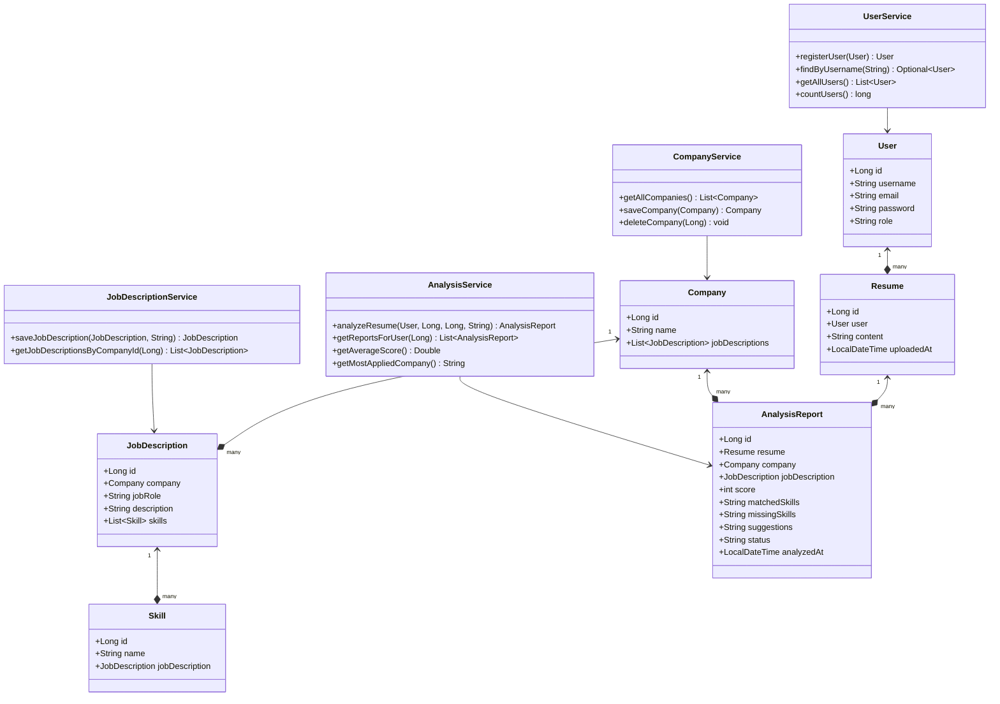
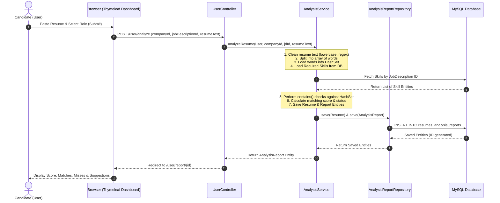
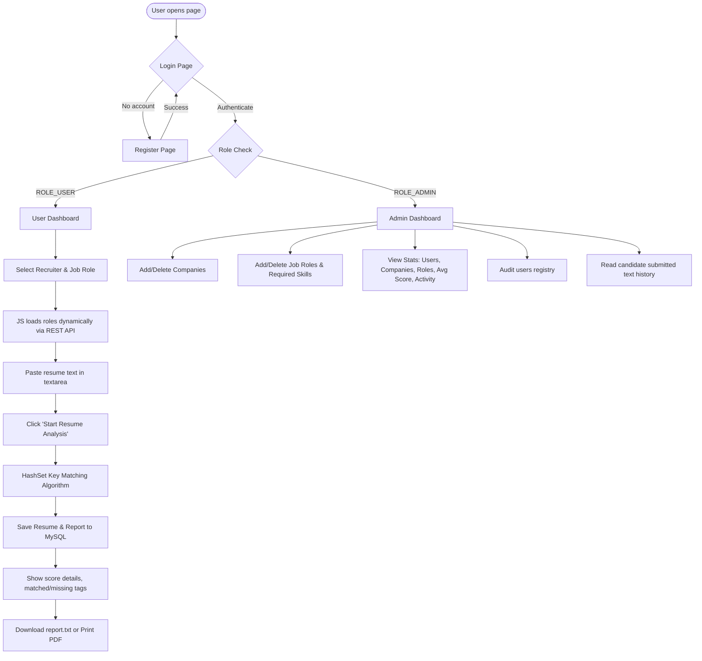

# CVLens - B.Tech Major Project Report

This documentation serves as the complete project report and viva preparation guide for the **CVLens** project.

---

## 1. Project Overview & Objective

The **CVLens** is a web-based portal developed to automate the analysis of candidate resumes against job role descriptions specified by recruiters. It calculates a matching score, identifies matched and missing skills, and generates suggestions for improvement.

### Key Viva Focus Areas:
* **No Heavy/AI Dependencies**: It intentionally avoids complex AI, Machine Learning, NLP, or heavy third-party text parsing libraries (e.g. Apache PDFBox/POI) to maintain a **simple, beginner-friendly, and explainable architecture** suitable for viva examinations.
* **Core Software Engineering**: Focuses on clean layered architecture (MVC), unified database structures, role-based security, and efficient Java standard collection structures.
* **Explainable Matching**: Employs a **HashSet-based keyword matching algorithm** utilizing standard String manipulation, guaranteeing $O(1)$ constant-time lookup performance and easily explainable logic.

---

## 2. System Architecture & UML Diagrams

### 2.1 Entity Relationship (ER) Diagram

```mermaid
erDiagram
    users {
        int id PK
        varchar username UNIQUE
        varchar email UNIQUE
        varchar password
        varchar role
    }
    companies {
        int id PK
        varchar name UNIQUE
    }
    job_descriptions {
        int id PK
        int company_id FK
        varchar job_role
        text description
    }
    skills {
        int id PK
        int job_description_id FK
        varchar name
    }
    resumes {
        int id PK
        int user_id FK
        text content
        datetime uploaded_at
    }
    analysis_reports {
        int id PK
        int resume_id FK
        int company_id FK
        int score
        text matched_skills
        text missing_skills
        text suggestions
        varchar status
        datetime analyzed_at
    }

    companies ||--o{ job_descriptions : "has multiple roles"
    job_descriptions ||--o{ skills : "requires"
    users ||--o{ resumes : "submits"
    resumes ||--o{ analysis_reports : "analyzes"
    companies ||--o{ analysis_reports : "associated_with"
```

---

### 2.2 Class Diagram



---

### 2.3 Use Case Diagram

```mermaid
leftToRightDirection
actor "Candidate (User)" as UserActor
actor "System Admin" as AdminActor

rectangle "CVLens" {
    usecase "Register & Login" as UC1
    usecase "Paste & Submit Resume" as UC2
    usecase "Select Company & Role" as UC3
    usecase "Analyze Resume" as UC4
    usecase "View Results & Suggestions" as UC5
    usecase "Download Text Report" as UC6
    
    usecase "Manage Recruiters (CRUD)" as UC7
    usecase "Configure Job Roles & Skills" as UC8
    usecase "View System-wide Statistics" as UC9
    usecase "Audit User Accounts" as UC10
    usecase "Inspect Submitted Resumes" as UC11
}

UserActor --> UC1
UserActor --> UC2
UserActor --> UC3
UserActor --> UC4
UserActor --> UC5
UserActor --> UC6

AdminActor --> UC1
AdminActor --> UC7
AdminActor --> UC8
AdminActor --> UC9
AdminActor --> UC10
AdminActor --> UC11
```

---

### 2.4 Sequence Diagram: Resume Submission & Analysis



---

### 2.5 Project Flow Diagram



---

## 3. Database Schema Definitions

### 1. `users`
Stores user credentials for both candidates and administrators.
* `id` (INT Auto-Increment, PK): Unique identifier.
* `username` (VARCHAR(50), UNIQUE): Unique username.
* `email` (VARCHAR(100), UNIQUE): Email address.
* `password` (VARCHAR(255)): BCrypt encoded hash.
* `role` (VARCHAR(20)): User role (`ROLE_USER` or `ROLE_ADMIN`).

### 2. `companies`
Stores names of recruiters.
* `id` (INT Auto-Increment, PK): Unique identifier.
* `name` (VARCHAR(100), UNIQUE): Registered company name.

### 3. `job_descriptions`
Contains job roles, associated recruiter, and full description text.
* `id` (INT Auto-Increment, PK): Unique identifier.
* `company_id` (INT, FK): Relates to `companies(id)`.
* `job_role` (VARCHAR(100)): Job designation name (e.g. Frontend Developer).
* `description` (TEXT): Full description responsibilities details.

### 4. `skills`
Lists exact required skills for each job role.
* `id` (INT Auto-Increment, PK): Unique identifier.
* `job_description_id` (INT, FK): Relates to `job_descriptions(id)`.
* `name` (VARCHAR(50)): Required keyword (e.g. Java).

### 5. `resumes`
Stores plain text of submitted resumes.
* `id` (INT Auto-Increment, PK): Unique identifier.
* `user_id` (INT, FK): Candidate who submitted, relates to `users(id)`.
* `content` (TEXT): Copied and pasted resume text content.
* `uploaded_at` (DATETIME): Submission timestamp.

### 6. `analysis_reports`
Houses final calculated results, suggestions, and stats.
* `id` (INT Auto-Increment, PK): Unique identifier.
* `resume_id` (INT, FK): Relates to `resumes(id)`.
* `company_id` (INT, FK): Relates to `companies(id)`.
* `job_description_id` (INT, FK): Relates to `job_descriptions(id)`.
* `score` (INT): Matching score (0 to 100).
* `matched_skills` (TEXT): Comma-separated list of matched keywords.
* `missing_skills` (TEXT): Comma-separated list of missing keywords.
* `suggestions` (TEXT): System-generated advice based on missing items.
* `status` (VARCHAR(50)): Overall evaluation status label.
* `analyzed_at` (DATETIME): Computation timestamp.

---

## 4. Core Algorithm & String Matching Logic

The matching system processes inputs using a linear text classification pipeline:

1. **Preprocessing**:
   * **Convert to Lowercase**: Forces all input letters to lowercase (`resume.toLowerCase()`) to avoid casing mismatches (e.g. `Java` matching `java`).
   * **Remove Punctuation**: Regular expression replacing special symbols and punctuation with spaces: `resume.replaceAll("[^a-zA-Z0-9\\s]", " ")`. This isolates raw alphanumeric keywords.
2. **Tokenization & Hashing**:
   * **Split into Words**: Splits the cleaned resume text string using whitespace delimiters: `resume.split("\\s+")`.
   * **HashSet Injection**: Adds words into a `HashSet<String> resumeWords`. Since `HashSet` utilizes buckets and hash functions, contains/lookup checking runs in **$O(1)$ constant time**.
3. **Keyword Matching**:
   * Required skills are loaded from the database for the selected job position.
   * For each skill:
     * If the skill contains spaces (multi-word, e.g. `spring boot`), the system checks if the entire preprocessed resume text contains the phrase: `cleanedResume.contains(skillName)`.
     * If the skill is a single word (e.g. `java`), it queries the set: `resumeWords.contains(skillName)`.
4. **Scoring Formula**:
   $$\text{Resume Score} = \left( \frac{\text{Matched Required Skills}}{\text{Total Required Skills}} \right) \times 100$$
5. **Status Matrix**:
   * **90% - 100%**: *Excellent*
   * **75% - 89%**: *Good*
   * **50% - 74%**: *Average*
   * **Below 50%**: *Needs Improvement*

---

## 5. Time and Space Complexity Analysis

### Time Complexity:
Let $N$ represent the number of characters in the candidate resume, $W$ represent the number of words generated from the resume, and $S$ represent the count of required skills configured in the job role.
1. **Preprocessing (Lowercase and Regex)**: $O(N)$ because the regex scan inspects characters sequentially.
2. **Splitting & HashSet Population**: $O(W)$ since splitting takes linear time and inserting elements into a `HashSet` takes average $O(1)$ time per word.
3. **Matching Iteration**:
   * For each required skill ($S$ total skills):
     * If single-word: HashSet contains lookup takes $O(1)$ time.
     * If multi-word (length $M$ characters): Substring contains check on preprocessed resume takes $O(N)$ worst-case time (using standard Boyer-Moore or KMP substring contains algorithms).
   * Worst-case Matching time: $O(S \times N)$.
4. **Total Worst-case Time Complexity**:
   $$\text{Total Time} \approx O(N + W + S \times N) \approx O(S \times N)$$
   Since resume text ($N$) and required skills list ($S$) are small sizes in practice, execution takes **under 15 milliseconds**, making it extremely performant.

### Space Complexity:
1. **Cleaned Text Buffers**: Stores duplicates of the resume string, requiring $O(N)$ auxiliary space.
2. **HashSet**: Stores $W$ unique words of the resume.
3. **Total Space Complexity**:
   $$\text{Total Space} \approx O(N + W)$$
   Highly memory efficient.

---

## 6. How to Run the Project (Viva Demo Steps)

### Prerequisites:
1. **Java Development Kit (JDK) 21** installed.
2. **MySQL Server** running on port `3306`.
3. Database `cvlens_db` configured (or allow Hibernate to initialize it on startup).

### Start Commands:
1. Open terminal in the project directory.
2. Build and run the Spring Boot project using the Maven Wrapper:
   ```bash
   # Windows PowerShell
   .\mvnw.cmd spring-boot:run
   
   # Linux / macOS
   ./mvnw spring-boot:run
   ```
3. Open browser and visit: `http://localhost:8080`

### Initial Accounts to Demo:
* **Admin Login**:
  * Username: `admin`
  * Password: `admin123`
  * Role: Admin
* **User (Candidate) Login**:
  * Username: `john_doe`
  * Password: `user123`
  * Role: User
  *(Or register a new account on the portal)*
