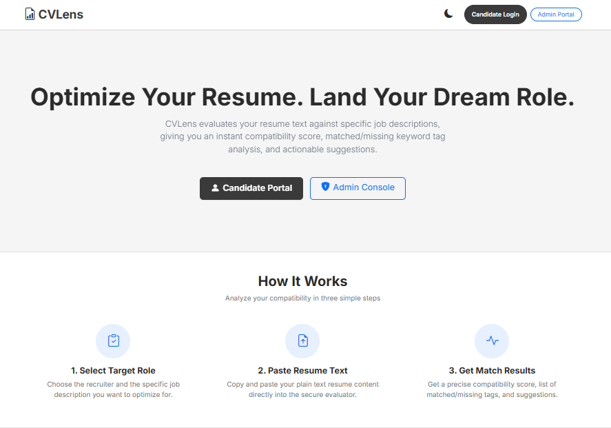
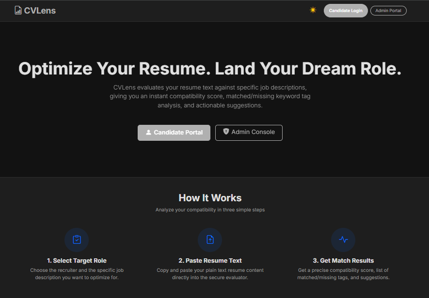
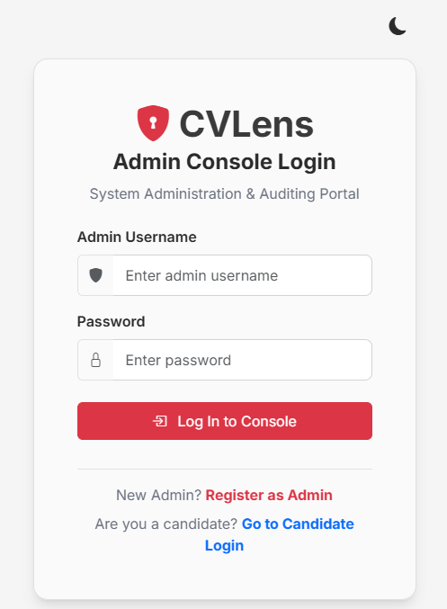
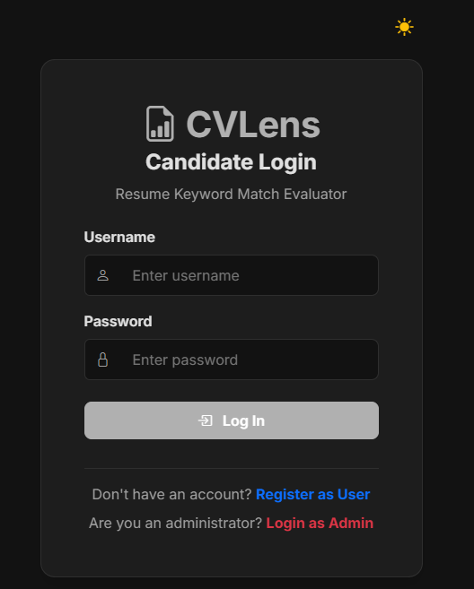
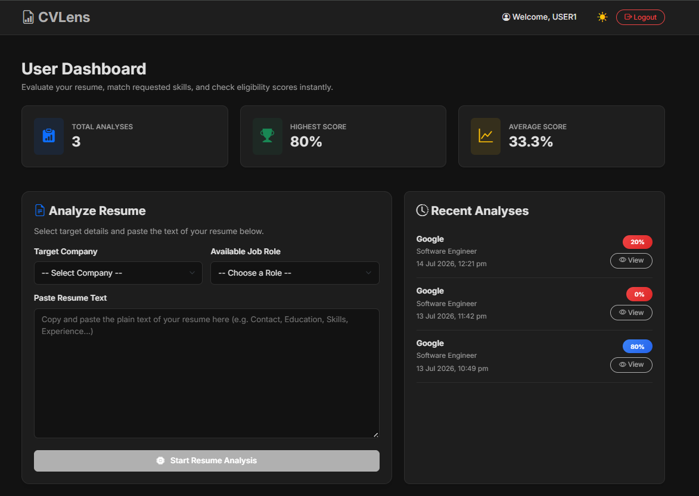
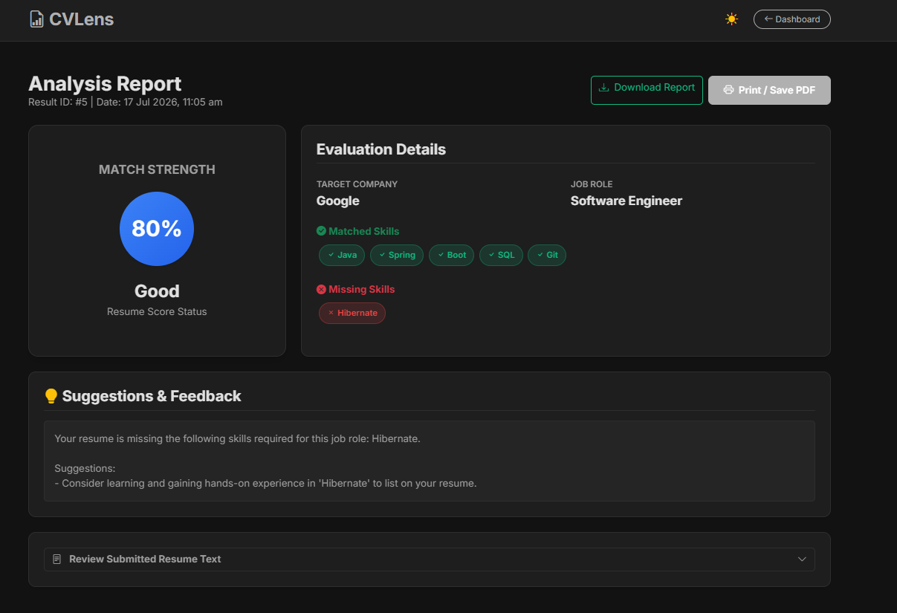
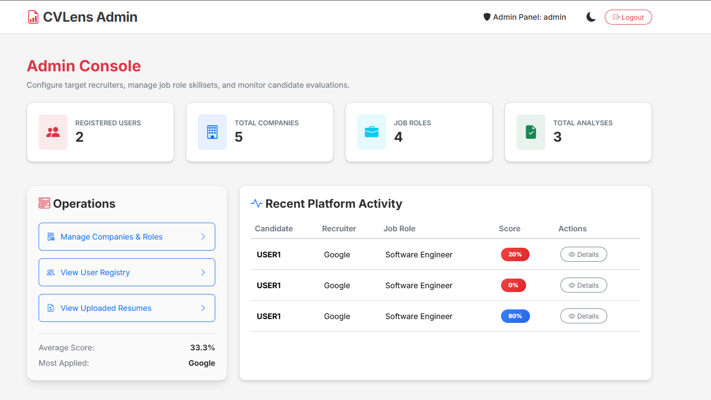

<div align="center">

# 📄 CVLens
### Smart Resume Analyzer


<br><br>

A full-stack web application that analyzes resumes against job descriptions, calculates skill matching, identifies missing skills, and provides personalized improvement suggestions — built without any AI/ML libraries so the matching logic stays fully explainable.

Built using **Spring Boot**, **Spring Security**, **Hibernate**, **MySQL**, and **Thymeleaf**.

</div>

---

# ✨ Features

### 👤 User Features

- 🔐 Secure Registration & Login
- 📄 Resume Submission
- 💼 Company & Job Role Selection
- 📊 Resume Analysis
- 🎯 Skill Match Percentage
- ❌ Missing Skills Detection
- 💡 Personalized Suggestions
- 📜 Previous Analysis History

### 👨‍💼 Admin Features

- 🔐 Admin Authentication
- 🏢 Company Management
- 💼 Job Role Management
- 🧠 Skill Management
- 📋 Resume Reports
- 📊 Dashboard Management

---

# 🖥 Tech Stack

| Category | Technologies |
|----------|--------------|
| **Language** | Java 21 |
| **Framework** | Spring Boot 3.3.1 |
| **Backend** | Spring MVC + REST |
| **Security** | Spring Security 6 (BCrypt + Form Login) |
| **Database** | MySQL 8 |
| **ORM** | Hibernate (Spring Data JPA) |
| **Frontend** | HTML, CSS, Vanilla JavaScript (dark/light theme) |
| **Template Engine** | Thymeleaf 3 |
| **Build Tool** | Maven (via Maven Wrapper) |

---

# 🏗 System Architecture

```
              User
                │
                ▼
        Spring MVC Controller
                │
                ▼
        Service Layer (Business Logic)
                │
                ▼
      Hibernate / Spring Data JPA
                │
                ▼
             MySQL Database
```

---

# ⚙️ Workflow

```
User Login
      │
      ▼
Select Company & Job Role
      │
      ▼
Paste Resume
      │
      ▼
Extract Resume Keywords
      │
      ▼
Fetch Required Skills
      │
      ▼
Compare Skills
      │
      ▼
Generate Report
      │
      ├── Match %
      ├── Matched Skills
      ├── Missing Skills
      └── Suggestions
```

---

# 🧠 Matching Algorithm

The application uses a **HashSet-based keyword matching algorithm** for efficient skill comparison — intentionally avoiding AI/ML libraries to keep the logic fully explainable for academic viva.

### Steps

- Convert resume text to lowercase and strip punctuation
- Tokenize and load words into a `HashSet<String>`
- Fetch required skills for the selected job role from the database
- Single-word skills → `HashSet.contains()` (O(1) avg); multi-word skills → substring match
- Calculate the matching percentage and generate suggestions for missing skills

### Formula

```text
Match Score = (Matched Skills / Total Required Skills) × 100
```

### Advantages

- ⚡ O(1) average lookup
- 🚀 Fast processing
- 🧩 Simple, fully explainable implementation
- 📈 Easily scalable

> Full complexity analysis, ER/class/sequence diagrams, and the theoretical justification for each data structure are in [`DOCUMENTATION.md`](./DOCUMENTATION.md).

---

# 🗄 Database Entities

- 👤 User
- 🏢 Company
- 💼 Job Description
- 🧠 Skill
- 📄 Resume
- 📊 Analysis Report

---

# 🔒 Security Features

- BCrypt Password Encryption
- Spring Security Authentication
- Role-Based Authorization (`ROLE_USER` / `ROLE_ADMIN`)
- Session Management
- Protected Routes

> Note: CSRF protection is disabled for this academic demo — a known tradeoff, not recommended for production use.
 
---
 

# 📸 Screenshots

---

## Home Page
 


 
---
 
## Login
 


 
---
 
## User Page
 

 
---
 
## Sample Resume Analysis
 

 
---
 
## Admin Page
 

 
---

# 📂 Project Structure

```
CVLens
│
├── src
│   ├── main
│   │   ├── java/com/example/sra
│   │   │   ├── controller
│   │   │   ├── service
│   │   │   ├── repository
│   │   │   ├── entity
│   │   │   ├── dto
│   │   │   ├── security
│   │   │   └── config
│   │   │
│   │   ├── resources
│   │   │   ├── templates
│   │   │   ├── static
│   │   │   ├── application.properties          (git-ignored, local only)
│   │   │   └── application.properties.example
│
├── DOCUMENTATION.md   ← full academic report (ER/class/sequence diagrams, complexity analysis)
├── pom.xml
├── README.md
└── LICENSE
```

---

# 🚀 Getting Started

### Prerequisites
- JDK 21+
- MySQL 8+ running on port `3306`

### Clone the Repository

```bash
git clone https://github.com/<your-username>/CVLens.git
cd CVLens
```

### Configure the Database

Copy the example config and fill in your local credentials:

```bash
cp src/main/resources/application.properties.example src/main/resources/application.properties
```

Then edit `application.properties`:

```properties
spring.datasource.username=root
spring.datasource.password=YOUR_PASSWORD
```

The database `sra_db` is auto-created on first run (`createDatabaseIfNotExist=true`, `ddl-auto=update`) — no manual `CREATE DATABASE` needed.

### Run

```bash
./mvnw spring-boot:run        # macOS/Linux
.\mvnw.cmd spring-boot:run    # Windows
```

Visit

```
http://localhost:8080
```

### Default Seeded Credentials

| Role | Username | Password |
|---|---|---|
| Admin | `admin` | `admin123` |
| User | `john_doe` | `user123` |

> Seeded automatically on startup by `DatabaseInitializer` — for local/academic demo use only.

---

# 🌟 Future Enhancements

- 📄 PDF Resume Upload
- 🤖 AI-Based Resume Analysis
- 🧠 NLP Skill Extraction
- 📈 ATS Compatibility Score
- 🎤 Interview Question Generator
- 📧 Email Notifications
- ☁ Cloud Deployment

---

# 👨‍💻 Author

### **Pulkit Sikri**

B.Tech Computer Science & Engineering

Maharaja Surajmal Institute of Technology (MSIT)

---

<div align="center">

### ⭐ If you found this project useful, consider giving it a Star!

Made using Java & Spring Boot

</div>
